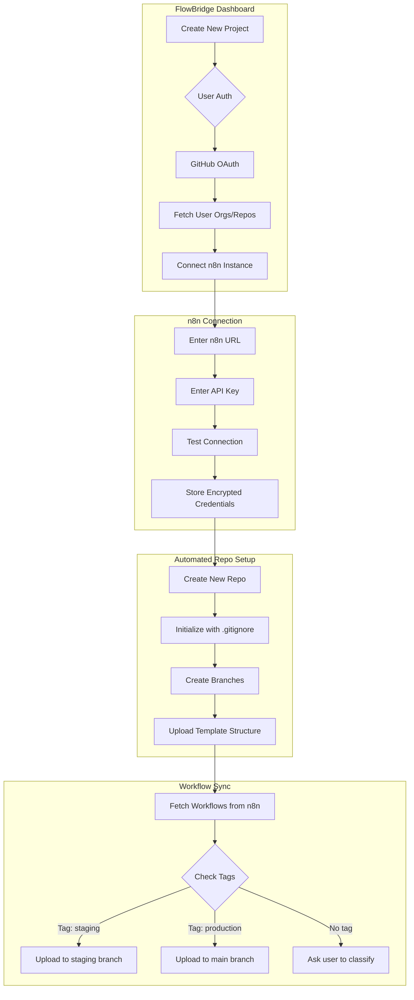
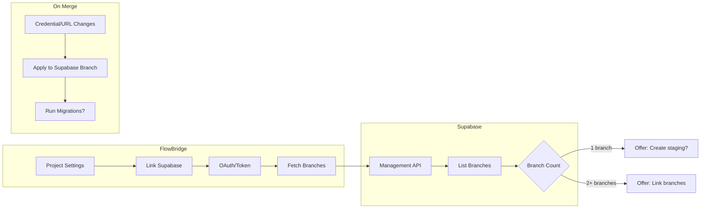

# FlowBridge Improvement Plan

## 📋 Overview

This document outlines a comprehensive plan to upgrade the Wingm8n_FlowBridge n8n workflow merge system, addressing three major areas:

1. **Multi-Credential Detection Fix** - Support multiple credentials of the same type/method
2. **Automated Repository Management** - User-driven repo creation and workflow uploads
3. **Supabase Branch Integration** - Intelligent Supabase branch detection and management

---

## 🔴 Issue #1: Multi-Credential Detection Fix

### Problem Statement

Currently, when a workflow uses multiple credentials of the **same type** (e.g., two different Supabase credentials), only **one** is detected. This happens because:

1. In [`extractCredentials()`](file:///c:/Users/AboodKh/Documents/Projects/Wingm8n_FlowBridge/shared/utils/workflow-parser.ts#L236-L259), credentials are stored in a `Map<string, Credential>` keyed by `cred.id`
2. This correctly captures unique credentials, but the **aggregation logic** in [`pr-analyzer.service.ts`](file:///c:/Users/AboodKh/Documents/Projects/Wingm8n_FlowBridge/server/services/pr-analyzer.service.ts#L212-L678) may lose context about which nodes use which credentials

### Root Cause Analysis

```typescript
// Current logic in workflow-parser.ts (line 244-254)
Object.entries(node.credentials).forEach(([key, cred]: [string, any]) => {
  if (cred.id && !credentials.has(cred.id)) {  // ⚠️ Only adds if ID not seen
    credentials.set(cred.id, {
      id: cred.id,
      name: cred.name || key,
      type: key,  // "supabaseApi" etc.
      nodeType: node.type,
      // ...
    });
  }
});
```

The issue manifests when:
- **Workflow A** uses Supabase credential `ID: abc123` (Production DB)
- **Workflow B** uses Supabase credential `ID: xyz789` (Staging DB)
- Both are `supabaseApi` type, but only one shows for comparison if the comparison logic assumes "one credential per type"

### Proposed Solution

#### Phase 1: Credential Extraction Enhancement

**[MODIFY]** `shared/utils/workflow-parser.ts`

```typescript
// NEW: Track credentials with usage context
export interface CredentialWithUsage extends Credential {
  usedByNodes: Array<{
    nodeId: string;
    nodeName: string;
    nodeType: string;
  }>;
}

export function extractCredentialsWithUsage(workflow: N8NWorkflow): CredentialWithUsage[] {
  const credentials = new Map<string, CredentialWithUsage>();

  workflow.nodes?.forEach((node: N8NNode) => {
    if (node.credentials) {
      Object.entries(node.credentials).forEach(([key, cred]: [string, any]) => {
        if (cred.id) {
          if (credentials.has(cred.id)) {
            // Add node to existing credential's usage list
            credentials.get(cred.id)!.usedByNodes.push({
              nodeId: node.id,
              nodeName: node.name,
              nodeType: node.type
            });
          } else {
            credentials.set(cred.id, {
              id: cred.id,
              name: cred.name || key,
              type: key,
              nodeType: node.type,
              nodeAuthType: node.parameters?.authentication,
              usedByNodes: [{
                nodeId: node.id,
                nodeName: node.name,
                nodeType: node.type
              }]
            });
          }
        }
      });
    }
  });

  return Array.from(credentials.values());
}
```

#### Phase 2: Credential Registry Enhancement

**[MODIFY]** `server/services/pr-analyzer.service.ts`

Update the credential registry to group by **type** and include **all credentials** of that type:

```typescript
// Current (line 89)
const allMainCredentials = new Map<string, Credential[]>(); // Type -> Credential[]

// Enhancement: Also build a full credential list
const allCredentialsList: Credential[] = [];
mainWorkflows.workflows.forEach(w => {
  const creds = extractCredentialsWithUsage(w.content);
  creds.forEach(c => {
    allCredentialsList.push(c);
    
    if (!allMainCredentials.has(c.type)) {
      allMainCredentials.set(c.type, []);
    }
    const existingList = allMainCredentials.get(c.type)!;
    if (!existingList.some(ex => ex.id === c.id)) {
      existingList.push(c);
    }
  });
});
```

#### Phase 3: UI Enhancement

**[MODIFY]** Credential selection UI to show:
- All credentials of the same type as alternatives
- Clear labeling: "Production Supabase", "Staging Supabase", etc.
- Node usage context: "Used by: Node1, Node2, Node3"

---

## 🔵 Issue #2: Automated Repository Management + n8n Instance Connection

### Current State

Users manually create GitHub repos and upload JSON files. The system then reads from these repos.

### New Vision

The dashboard should:
1. **Connect to user's n8n instance** (URL + API key)
2. **Fetch workflows by tag** (detect "staging" vs "production" tags)
3. **Auto-upload workflows** to the correct GitHub branch
4. **Sync on demand or automatically**

### Proposed Architecture



---

### 🔌 n8n Instance Connection

#### User Flow

1. User clicks **"Connect n8n Instance"** in project settings
2. User enters:
   - **n8n URL**: `https://my-n8n.example.com` or `https://app.n8n.cloud`
   - **API Key**: Generated from n8n Settings → API → Personal Access Tokens
3. FlowBridge **tests the connection** by calling `GET /workflows`
4. On success, credentials are **encrypted and stored** in the database
5. User can now **fetch workflows** directly from their n8n instance

#### Workflow Fetching Options

| Method | Description | Use Case |
|--------|-------------|----------|
| **By Tag** | Fetch all workflows with `staging` or `production` tag | Recommended - clear separation |
| **By Name Prefix** | Fetch workflows starting with `staging-` or `prod-` | Alternative naming convention |
| **All Workflows** | Fetch everything, user classifies manually | Initial import |

#### Tag-Based Classification

When fetching workflows from n8n:

```typescript
// Workflow has tags: ["staging", "automation"]
// → Upload to staging branch

// Workflow has tags: ["production", "crm"]  
// → Upload to main branch

// Workflow has tags: ["automation"] (no env tag)
// → Show in "Unclassified" list, user assigns branch
```

### Implementation Plan

#### Phase 0: n8n Instance Service

**[NEW]** `server/services/n8n-instance.service.ts`

```typescript
import axios from 'axios';
import type { N8NWorkflow } from '@shared/types/workflow.types';

export interface N8NInstanceConfig {
  baseUrl: string;  // e.g., "https://my-n8n.example.com"
  apiKey: string;   // User's n8n API key
}

export class N8NInstanceService {
  private baseUrl: string;
  private apiKey: string;

  constructor(config: N8NInstanceConfig) {
    this.baseUrl = config.baseUrl.replace(/\/$/, ''); // Remove trailing slash
    this.apiKey = config.apiKey;
  }

  private get headers() {
    return {
      'X-N8N-API-KEY': this.apiKey,
      'Content-Type': 'application/json',
    };
  }

  // Test connection to the n8n instance
  async testConnection(): Promise<{ success: boolean; version?: string; error?: string }> {
    try {
      const response = await axios.get(`${this.baseUrl}/api/v1/workflows`, {
        headers: this.headers,
        params: { limit: 1 }
      });
      return { success: true, version: response.headers['x-n8n-version'] };
    } catch (error: any) {
      return { 
        success: false, 
        error: error.response?.data?.message || error.message 
      };
    }
  }

  // Fetch all workflows from the n8n instance
  async fetchAllWorkflows(): Promise<N8NWorkflow[]> {
    const response = await axios.get(`${this.baseUrl}/api/v1/workflows`, {
      headers: this.headers,
      params: { limit: 1000 } // Get all workflows
    });
    return response.data.data;
  }

  // Fetch workflows by tag name
  async fetchWorkflowsByTag(tagName: string): Promise<N8NWorkflow[]> {
    const allWorkflows = await this.fetchAllWorkflows();
    
    return allWorkflows.filter(workflow => 
      workflow.tags?.some(tag => 
        typeof tag === 'string' 
          ? tag.toLowerCase() === tagName.toLowerCase()
          : tag.name?.toLowerCase() === tagName.toLowerCase()
      )
    );
  }

  // Fetch staging workflows (by tag or prefix)
  async fetchStagingWorkflows(): Promise<N8NWorkflow[]> {
    const allWorkflows = await this.fetchAllWorkflows();
    
    return allWorkflows.filter(workflow => {
      // Check for "staging" tag
      const hasTag = workflow.tags?.some(tag => {
        const tagName = typeof tag === 'string' ? tag : tag.name;
        return tagName?.toLowerCase().includes('staging') || 
               tagName?.toLowerCase().includes('dev');
      });
      
      // Check for "staging-" prefix in name
      const hasPrefix = workflow.name?.toLowerCase().startsWith('staging-');
      
      return hasTag || hasPrefix;
    });
  }

  // Fetch production workflows (by tag or absence of staging indicators)
  async fetchProductionWorkflows(): Promise<N8NWorkflow[]> {
    const allWorkflows = await this.fetchAllWorkflows();
    
    return allWorkflows.filter(workflow => {
      // Check for "production" or "prod" tag
      const hasTag = workflow.tags?.some(tag => {
        const tagName = typeof tag === 'string' ? tag : tag.name;
        return tagName?.toLowerCase().includes('production') || 
               tagName?.toLowerCase() === 'prod' ||
               tagName?.toLowerCase() === 'main';
      });
      
      return hasTag;
    });
  }

  // Classify all workflows into staging, production, and unclassified
  async classifyWorkflows(): Promise<{
    staging: N8NWorkflow[];
    production: N8NWorkflow[];
    unclassified: N8NWorkflow[];
  }> {
    const allWorkflows = await this.fetchAllWorkflows();
    
    const staging: N8NWorkflow[] = [];
    const production: N8NWorkflow[] = [];
    const unclassified: N8NWorkflow[] = [];
    
    for (const workflow of allWorkflows) {
      const tags = workflow.tags?.map(t => 
        typeof t === 'string' ? t.toLowerCase() : t.name?.toLowerCase()
      ) || [];
      
      if (tags.some(t => t?.includes('staging') || t?.includes('dev'))) {
        staging.push(workflow);
      } else if (tags.some(t => t?.includes('production') || t === 'prod' || t === 'main')) {
        production.push(workflow);
      } else if (workflow.name?.toLowerCase().startsWith('staging-')) {
        staging.push(workflow);
      } else {
        unclassified.push(workflow);
      }
    }
    
    return { staging, production, unclassified };
  }

  // Download a specific workflow by ID
  async downloadWorkflow(workflowId: string): Promise<N8NWorkflow> {
    const response = await axios.get(`${this.baseUrl}/api/v1/workflows/${workflowId}`, {
      headers: this.headers,
    });
    return response.data;
  }
}
```

#### Phase 1: n8n Connection Router

**[NEW]** `server/routers/n8n-connection.ts`

```typescript
import { router, protectedProcedure } from '../_core/trpc';
import { z } from 'zod';
import { N8NInstanceService } from '../services/n8n-instance.service';
import { encrypt, decrypt } from '../_core/crypto'; // You'll need an encryption utility

export const n8nConnectionRouter = router({
  // Test n8n connection before saving
  testConnection: protectedProcedure
    .input(z.object({
      n8nUrl: z.string().url(),
      apiKey: z.string().min(10),
    }))
    .mutation(async ({ input }) => {
      const service = new N8NInstanceService({
        baseUrl: input.n8nUrl,
        apiKey: input.apiKey,
      });
      
      return service.testConnection();
    }),

  // Save n8n connection credentials (encrypted)
  saveConnection: protectedProcedure
    .input(z.object({
      projectId: z.string(),
      n8nUrl: z.string().url(),
      apiKey: z.string().min(10),
    }))
    .mutation(async ({ ctx, input }) => {
      // Encrypt the API key before storing
      const encryptedApiKey = encrypt(input.apiKey);
      
      await ctx.db.update(projects)
        .set({
          n8nInstanceUrl: input.n8nUrl,
          n8nApiKeyEncrypted: encryptedApiKey,
        })
        .where(eq(projects.id, input.projectId));
      
      return { success: true };
    }),

  // Fetch and classify workflows from connected n8n instance
  fetchWorkflows: protectedProcedure
    .input(z.object({ projectId: z.string() }))
    .query(async ({ ctx, input }) => {
      const project = await ctx.db.query.projects.findFirst({
        where: eq(projects.id, input.projectId)
      });
      
      if (!project?.n8nInstanceUrl || !project?.n8nApiKeyEncrypted) {
        throw new Error('n8n instance not connected');
      }
      
      const service = new N8NInstanceService({
        baseUrl: project.n8nInstanceUrl,
        apiKey: decrypt(project.n8nApiKeyEncrypted),
      });
      
      return service.classifyWorkflows();
    }),

  // Sync workflows to GitHub branches
  syncToGitHub: protectedProcedure
    .input(z.object({
      projectId: z.string(),
      syncStaging: z.boolean().default(true),
      syncProduction: z.boolean().default(true),
    }))
    .mutation(async ({ ctx, input }) => {
      const project = await ctx.db.query.projects.findFirst({
        where: eq(projects.id, input.projectId)
      });
      
      const n8nService = new N8NInstanceService({
        baseUrl: project.n8nInstanceUrl!,
        apiKey: decrypt(project.n8nApiKeyEncrypted!),
      });
      
      const { staging, production } = await n8nService.classifyWorkflows();
      const results = { staging: 0, production: 0 };
      
      // Sync staging workflows to staging branch
      if (input.syncStaging) {
        for (const workflow of staging) {
          const filename = `workflows/${workflow.name.replace(/\s+/g, '_')}.json`;
          await ctx.githubService.createOrUpdateFile(
            project.repoOwner,
            project.repoName,
            filename,
            JSON.stringify(workflow, null, 2),
            project.stagingBranch
          );
          results.staging++;
        }
      }
      
      // Sync production workflows to main branch
      if (input.syncProduction) {
        for (const workflow of production) {
          const filename = `workflows/${workflow.name.replace(/\s+/g, '_')}.json`;
          await ctx.githubService.createOrUpdateFile(
            project.repoOwner,
            project.repoName,
            filename,
            JSON.stringify(workflow, null, 2),
            project.mainBranch
          );
          results.production++;
        }
      }
      
      return results;
    }),
});
```

#### Phase 2: Repository API Endpoints

**[NEW]** `server/routers/repository.ts`

```typescript
import { router, protectedProcedure } from '../_core/trpc';
import { z } from 'zod';

export const repositoryRouter = router({
  // Create a new repo for the user
  createProject: protectedProcedure
    .input(z.object({
      name: z.string().min(3),
      description: z.string().optional(),
      organization: z.string().optional(), // If user wants in an org
      isPrivate: z.boolean().default(true),
    }))
    .mutation(async ({ ctx, input }) => {
      const { githubService } = ctx;
      
      // 1. Create the repository
      const repo = await githubService.createRepository({
        name: input.name,
        description: input.description || 'FlowBridge n8n workflow management',
        private: input.isPrivate,
        auto_init: true, // Creates with README
      });
      
      // 2. Create staging branch from main
      await githubService.createBranch(repo.owner, repo.name, 'staging', 'main');
      
      // 3. Create folder structure
      await githubService.createFile(repo.owner, repo.name, 'workflows/.gitkeep', '', 'main');
      await githubService.createFile(repo.owner, repo.name, 'workflows/.gitkeep', '', 'staging');
      
      // 4. Store project in database
      await ctx.db.insert(projects).values({
        userId: ctx.user.id,
        repoOwner: repo.owner,
        repoName: repo.name,
        mainBranch: 'main',
        stagingBranch: 'staging',
      });
      
      return repo;
    }),

  // Upload workflow JSON to branch
  uploadWorkflow: protectedProcedure
    .input(z.object({
      projectId: z.string(),
      branch: z.enum(['main', 'staging']),
      workflow: z.any(), // N8N workflow JSON
    }))
    .mutation(async ({ ctx, input }) => {
      const project = await ctx.db.query.projects.findFirst({
        where: eq(projects.id, input.projectId)
      });
      
      const filename = `workflows/${input.workflow.name.replace(/\s+/g, '_')}.json`;
      
      await ctx.githubService.createOrUpdateFile(
        project.repoOwner,
        project.repoName,
        filename,
        JSON.stringify(input.workflow, null, 2),
        input.branch
      );
      
      return { success: true, filename };
    }),

  // List user's FlowBridge projects
  listProjects: protectedProcedure.query(async ({ ctx }) => {
    return ctx.db.query.projects.findMany({
      where: eq(projects.userId, ctx.user.id)
    });
  }),
});
```

#### Phase 3: Database Schema

**[NEW]** `drizzle/schema/projects.ts`

```typescript
import { sqliteTable, text, integer } from 'drizzle-orm/sqlite-core';

export const projects = sqliteTable('projects', {
  id: text('id').primaryKey(),
  userId: text('user_id').notNull(),
  repoOwner: text('repo_owner').notNull(),
  repoName: text('repo_name').notNull(),
  mainBranch: text('main_branch').default('main'),
  stagingBranch: text('staging_branch').default('staging'),
  
  // n8n Instance Connection
  n8nInstanceUrl: text('n8n_instance_url'),         // e.g., "https://my-n8n.example.com"
  n8nApiKeyEncrypted: text('n8n_api_key_encrypted'), // Encrypted API key
  
  // Supabase integration
  supabaseProjectId: text('supabase_project_id'),
  supabaseMainBranch: text('supabase_main_branch'),
  supabaseStagingBranch: text('supabase_staging_branch'),
  
  createdAt: integer('created_at', { mode: 'timestamp' }).defaultNow(),
  updatedAt: integer('updated_at', { mode: 'timestamp' }).defaultNow(),
});
```

#### Phase 4: Dashboard UI

**[NEW]** `client/src/pages/Projects.tsx`

```tsx
// Project creation wizard with:
// 1. Project name input
// 2. Organization selection (if user belongs to orgs)
// 3. Privacy toggle
// 4. Workflow import from n8n instance (optional)
```

**[NEW]** `client/src/components/CreateProjectWizard.tsx`

---

## 🟢 Issue #3: Supabase Branch Integration

### Vision

When a user links their Supabase project, FlowBridge should:

1. **Detect existing Supabase branches** (using Supabase Management API)
2. **Offer intelligent options:**
   - "You have 1 branch (`main`). Create a `staging` branch for merging?"
   - "You have 2 branches (`main`, `staging`). Link them to your workflow branches?"
   - "Merge to `main` without a separate branch?"

### Architecture



### Implementation Plan

#### Phase 1: Supabase Service

**[NEW]** `server/services/supabase.service.ts`

```typescript
import { createClient } from '@supabase/supabase-js';

export class SupabaseManagementService {
  private accessToken: string;
  private baseUrl = 'https://api.supabase.com/v1';
  
  constructor(accessToken: string) {
    this.accessToken = accessToken;
  }
  
  // List all projects the user has access to
  async listProjects(): Promise<SupabaseProject[]> {
    const res = await fetch(`${this.baseUrl}/projects`, {
      headers: { Authorization: `Bearer ${this.accessToken}` }
    });
    return res.json();
  }
  
  // List branches for a project
  async listBranches(projectRef: string): Promise<SupabaseBranch[]> {
    const res = await fetch(`${this.baseUrl}/projects/${projectRef}/branches`, {
      headers: { Authorization: `Bearer ${this.accessToken}` }
    });
    return res.json();
  }
  
  // Create a new branch
  async createBranch(projectRef: string, name: string, parentRef?: string): Promise<SupabaseBranch> {
    const res = await fetch(`${this.baseUrl}/projects/${projectRef}/branches`, {
      method: 'POST',
      headers: {
        Authorization: `Bearer ${this.accessToken}`,
        'Content-Type': 'application/json'
      },
      body: JSON.stringify({ name, parent_ref: parentRef })
    });
    return res.json();
  }
  
  // Get connection strings for a branch
  async getBranchConnectionInfo(projectRef: string, branchId: string): Promise<ConnectionInfo> {
    // Returns the database URL specific to that branch
    // Used to update credentials during merge
  }
}
```

#### Phase 2: Supabase Router

**[NEW]** `server/routers/supabase.ts`

```typescript
export const supabaseRouter = router({
  // Link Supabase to a project
  linkProject: protectedProcedure
    .input(z.object({
      flowbridgeProjectId: z.string(),
      supabaseProjectRef: z.string(),
    }))
    .mutation(async ({ ctx, input }) => {
      // Store the link
      await ctx.db.update(projects)
        .set({ supabaseProjectId: input.supabaseProjectRef })
        .where(eq(projects.id, input.flowbridgeProjectId));
    }),
  
  // Get branch options for a linked Supabase project
  getBranchOptions: protectedProcedure
    .input(z.object({ projectId: z.string() }))
    .query(async ({ ctx, input }) => {
      const project = await ctx.db.query.projects.findFirst({
        where: eq(projects.id, input.projectId)
      });
      
      if (!project?.supabaseProjectId) {
        return { linked: false };
      }
      
      const supabaseService = new SupabaseManagementService(ctx.supabaseToken);
      const branches = await supabaseService.listBranches(project.supabaseProjectId);
      
      return {
        linked: true,
        branches,
        recommendations: generateBranchRecommendations(branches),
      };
    }),
  
  // Create a Supabase branch for staging
  createStagingBranch: protectedProcedure
    .input(z.object({
      projectId: z.string(),
      branchName: z.string().default('staging'),
    }))
    .mutation(async ({ ctx, input }) => {
      // Create the branch and update project config
    }),
});

function generateBranchRecommendations(branches: SupabaseBranch[]): Recommendation[] {
  if (branches.length === 1) {
    return [{
      type: 'create_staging',
      message: 'You only have a production branch. Create a staging branch for safe testing?',
      action: 'Create Staging Branch',
    }];
  }
  
  if (branches.length >= 2) {
    const hasStaging = branches.some(b => b.name.includes('staging') || b.name.includes('dev'));
    if (hasStaging) {
      return [{
        type: 'link_existing',
        message: 'Link your existing branches to FlowBridge?',
        suggestedMapping: {
          main: branches.find(b => b.is_default)?.name || 'main',
          staging: branches.find(b => b.name.includes('staging'))?.name || branches[1].name,
        }
      }];
    }
  }
  
  return [];
}
```

#### Phase 3: Merge Integration

When merging workflows, if Supabase is linked:

1. **Detect Supabase credentials** in the workflow
2. **Auto-update connection strings** when merging from staging to main
3. **Optionally run migrations** (if user has migration files in repo)

---

## 📊 Summary of Changes

### New Files

| File | Purpose |
|------|---------|
| `server/services/n8n-instance.service.ts` | n8n API client for fetching workflows |
| `server/routers/n8n-connection.ts` | n8n connection and sync APIs |
| `server/routers/repository.ts` | Project creation and workflow upload APIs |
| `server/routers/supabase.ts` | Supabase integration APIs |
| `server/services/supabase.service.ts` | Supabase Management API client |
| `server/_core/crypto.ts` | Encryption utilities for API keys |
| `drizzle/schema/projects.ts` | Database schema for projects with n8n and Supabase fields |
| `client/src/pages/Projects.tsx` | Project list/creation page |
| `client/src/components/CreateProjectWizard.tsx` | Project creation wizard |
| `client/src/components/N8NConnectDialog.tsx` | n8n instance connection UI |
| `client/src/components/WorkflowSyncPanel.tsx` | Workflow fetch and sync UI |
| `client/src/components/SupabaseLinkDialog.tsx` | Supabase linking UI |

### Modified Files

| File | Changes |
|------|---------|
| `shared/utils/workflow-parser.ts` | Add `extractCredentialsWithUsage()` with node tracking |
| `server/services/pr-analyzer.service.ts` | Enhanced credential aggregation for multi-credential support |
| `shared/types/workflow.types.ts` | Add `CredentialWithUsage` interface |
| `client/src/components/CredentialPanel.tsx` | Show all credentials of same type as alternatives |

---

## 🚀 Implementation Phases

### Phase 1: Multi-Credential Fix (Priority: High) 
*Estimated: 2-3 days*

1. Update `extractCredentials()` to track node usage
2. Update PR analyzer credential aggregation
3. Update UI to show credential alternatives
4. Test with workflows using multiple credentials of same type

### Phase 2: n8n Instance Connection (Priority: High)
*Estimated: 3-4 days*

1. Implement `N8NInstanceService` with API connection
2. Add encryption utilities for API key storage
3. Implement `n8nConnectionRouter` with test/save/fetch/sync endpoints
4. Build "Connect n8n" dialog UI
5. Build workflow classification and sync panel
6. Test connection with real n8n instance

### Phase 3: Automated Repo Management (Priority: Medium)
*Estimated: 3-4 days*

1. Add database schema for projects
2. Implement repository creation API
3. Implement workflow upload API
4. Build project creation wizard UI
5. Build project dashboard

### Phase 4: Supabase Integration (Priority: Medium)
*Estimated: 5-7 days*

1. Implement Supabase Management API service
2. Add Supabase OAuth flow (or token input)
3. Build branch detection and recommendation logic
4. Build Supabase linking UI
5. Integrate with merge workflow for credential updates

---

## 🧪 Verification Plan

### Automated Tests

1. **Unit Tests** for `extractCredentialsWithUsage()`:
   ```bash
   pnpm test shared/utils/workflow-parser.test.ts
   ```

2. **Integration Tests** for PR Analyzer:
   ```bash
   pnpm test server/services/pr-analyzer.service.test.ts
   ```

### Manual Testing

1. **Multi-Credential Test:**
   - Create a workflow with 2 Supabase credentials (Production + Staging)
   - Verify both appear in the credential comparison panel
   - Verify user can select between them during merge

2. **Repository Creation Test:**
   - Log in with GitHub
   - Create a new project
   - Upload workflow JSON
   - Verify files appear in GitHub repo with correct structure

3. **Supabase Integration Test:**
   - Link a Supabase project
   - Verify branches are detected
   - Follow recommendation to create staging branch
   - Complete a merge and verify credential URLs are updated

---

## ❓ Open Questions for User

1. **Supabase Auth Method:** Do you want OAuth (user logs in to Supabase) or API token input (user pastes their management token)?

2. **Workflow Upload:** Should users upload JSONs through FlowBridge UI, or do you want a direct n8n integration (webhook to auto-push workflows)?

3. **Credential Naming Convention:** How should we identify Production vs Staging credentials? By name pattern? By explicit user tagging?

4. **Migration Support:** For Supabase, do you want FlowBridge to also handle database migrations (track migration files in the repo)?
